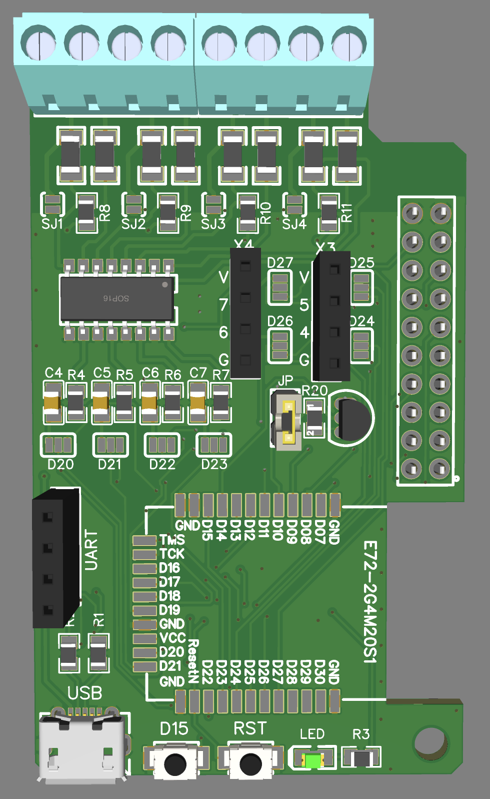
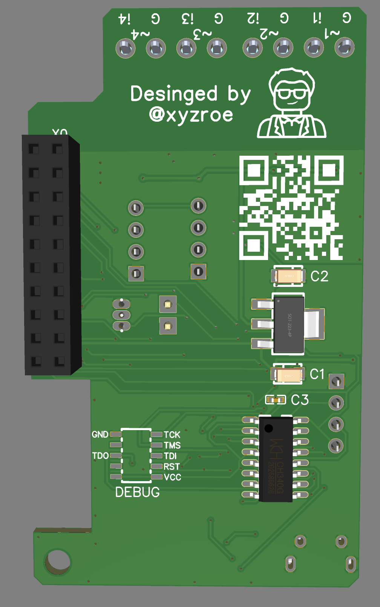
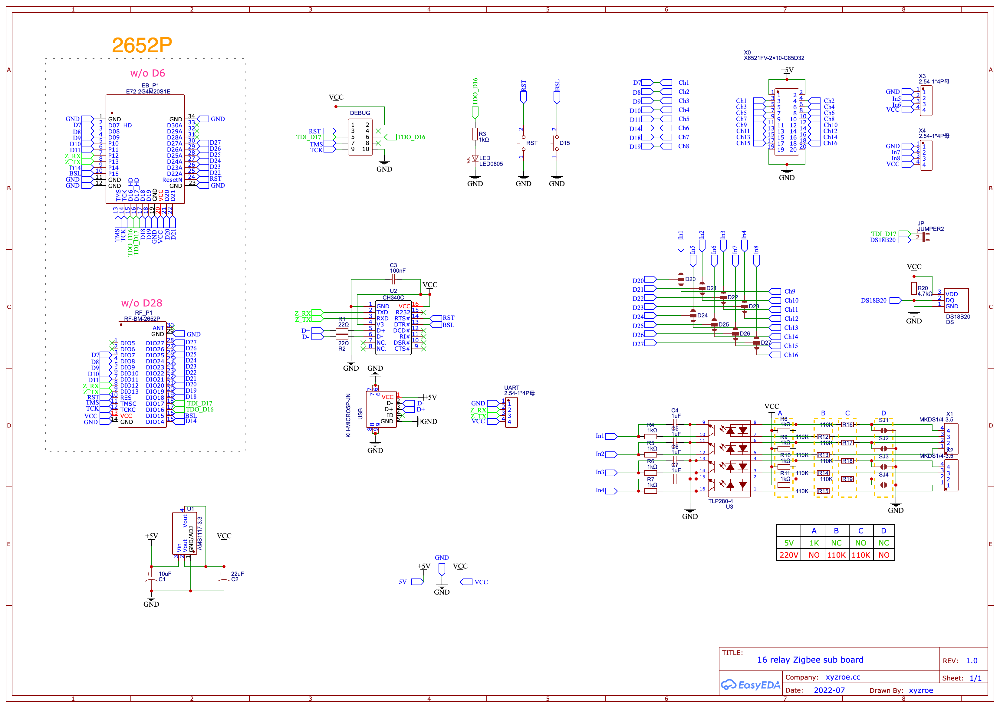
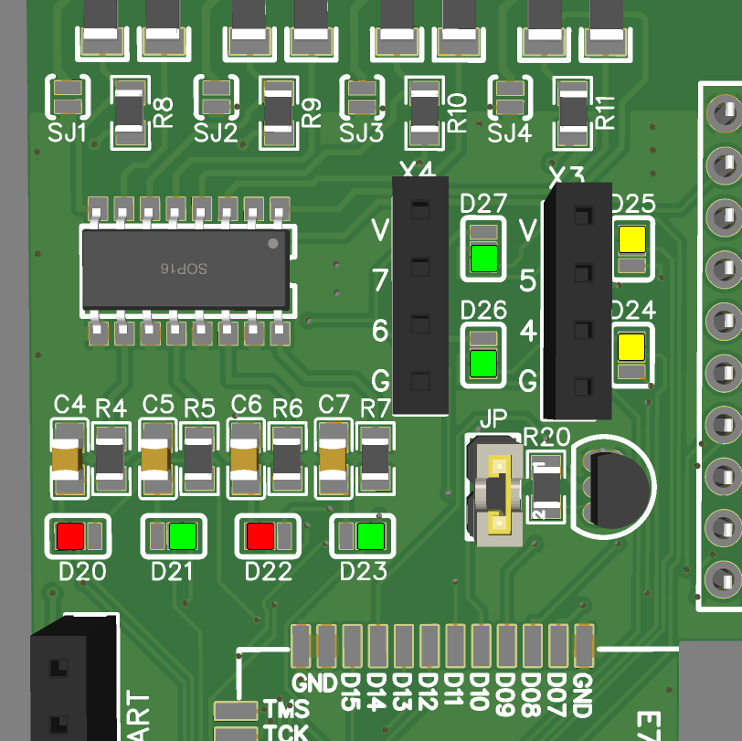
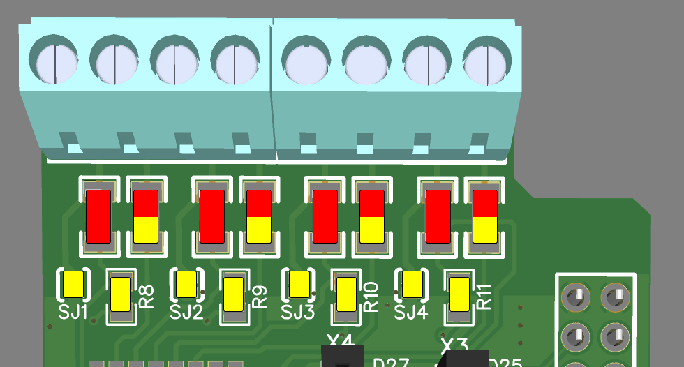
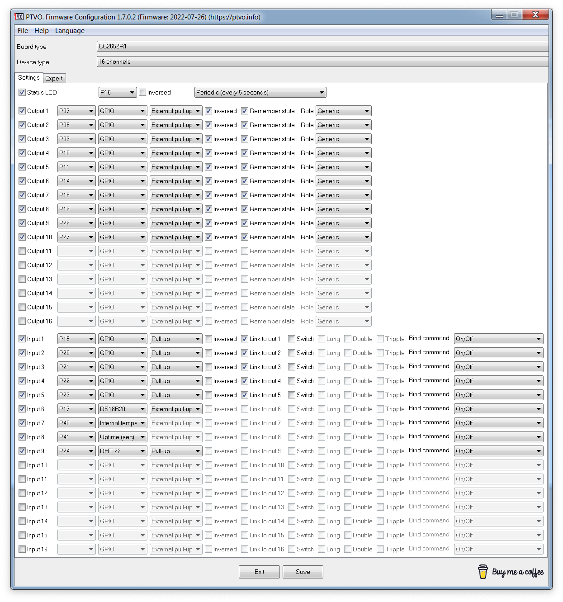

# 16-relay-Zigbee
Zigbee sub board to 16 relays board using CC2652, with 4 isolated digital inputs, 4 direct pins, DS18B20 on board and CH340 for flashing using USB.

Front | Back
:-:|:-:
  | 
  | 

### Schematic

## Jumpers
Due to the fact that the Zigby module has only 16 free pins, you have to give up some relays if you need to use input pins or sensors.

**Relays that always connected:**  
D7 - Relay 1  
...  
D11 - Relay 5   
D14 - Relay 6   
D18 - Relay 7    
D19 - Relay 8    

**Relays with jumpers:**  
D20 - Relay 9  
...  
D27 - Relay 16  

  
**RED** - isolated digital input on X1,X2  
**GREEN** - relay boards on X0  
**YELLOW** - direct IO on X3, X4  

*JP - connect DS18B20 to CC2652 TDI_D17 (may lead to the inability to flash using DEBUG)*  
*LED always connected to TDO_D16*  
*Button always connected to D15 (BSL or SBL pin)*  

## Inputs
**SOLDER ONLY ONE COLOR**  
  
**RED** - HIGH VOLTAGE control (5-300 AC/DC)   
**Electrical Hazard Risk**    

**YELLOW** - low voltage control (GND)

## Firmware - PTVO
In most cases, you will need the premium version. but it also works on the free version.
Below is one of the configuration options.

## Flashing
CC2652 comes with firmware with Serial bootloader (SBL) activated, so you don't need J-Link.   
I prefer to use [ZigStarGW-MT](https://github.com/xyzroe/ZigStarGW-MT), but you can also use cc2538_bsl.py or Flash Programmer 2.  

***Don't forget to activate SBL while making your firmware, otherwise you will need J-Link programmer to reactivate it***

## 3.3V relay board mod
Some revisions of 16-channel relay boards cannot control using 3.3V voltage, because, built-in optocouplers are powered by 5V.
Such boards need to be slightly redone - to separate the power supply of optocouplers from 5V and apply 3.3V to them.

An example of where you can take 3.3V is in the photo below (AMS1117).

### Binding
The firmware supports direct binding on input and output endpoints.

### Files to reproduce
* [Gerbers and BOM](https://github.com/xyzroe/16-relay-Zigbee/hardware)
* [Firmware - PTVO](https://ptvo.info)

### Like ♥️?

